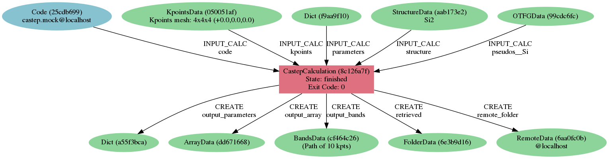
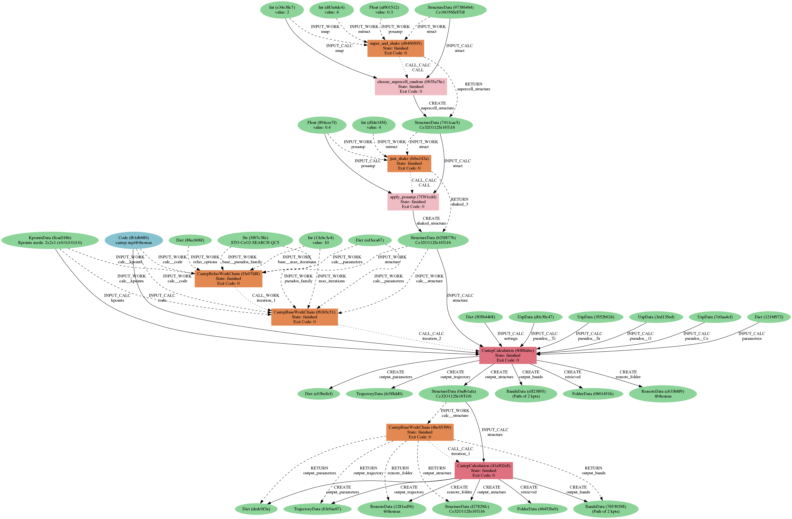

#######################################
A Plugin to interface CASTEP with AiiDA
#######################################

.. figure:: images/AiiDA_transparent_logo.png
    :width: 300px
    :align: center
    :target: `AiiDA`_

.. _AiiDA: http://www.aiida.net
.. _CASTEP: http://www.castep.org

Welcome to the documentation of ``aiida-castep``
================================================

`CASTEP`_ is a plane-wave pseudopotential density functional theory code.
This plugin allow CASTEP calculations to be run using `AiiDA`_.

The project home is located at http://gitlab.com/bz1/aiida-castep.

If you use this plugin and/or AiiDA for your research, please cite the following work:

.. highlights:: Giovanni Pizzi, Andrea Cepellotti, Riccardo Sabatini, Nicola Marzari,
  and Boris Kozinsky, *AiiDA: automated interactive infrastructure and database
  for computational science*, Comp. Mat. Sci 111, 218-230 (2016);
  http://dx.doi.org/10.1016/j.commatsci.2015.09.013; http://www.aiida.net.

Why bother?
===========

CASTEP calculations can be prepared and analysed  perfectly fine with a text editor and shell scripts.
However, there are several advantages of running CASTEP though Automated Interactive Infrastructure and Database for Computational Science (AiiDA).
I found it very hard to explain what AiiDA is and does in one or two sentences.
Hence, perhaps it is best to highlight some of and advantages of doing calculations this way:

* Preserving provenance - All input and outputs are stored in a database, together
  with relationships, e.g links between them. This form a graph and we can trace extract
  how the results is reached and make them reproducible. 

* Automated submission/retrieve/monitoring/parsing - more time can be spend to focus on preparing
  the right input for calculations and analysing the results.
  The rest of the boring jobs will be handled by AiiDA.
  The output will be parsed and made available for numerical analysis after the calculation is completed.

* Querying - the database can be queried easily to locate, for example, calculations with certain
  inputs parameters, or say all the children of a certain input structure.

* Automated workflows - you can write workflows, the use case can vary from simply recovering failed
  jobs automatically to complex high throughput computation projects.

* Detecting mistakes early - this plugin checks the inputs of a CASTEP calculation  before submitting to the remote cluster. Mistakes such as errors in keyword names or incompatible pairs will be catched.

Calculations ran though AiiDA can be also exported as plain files, in fact these files are stored in a
file repository so it is merely a copying + renaming process - you are not missing anything.

A graphical example
===================

The CASTEP code requires several text files as the input and gives to the output also in the plain text format.
These files, while simple and human readable, contains rich set of settings and information of the calculation.
With AiiDA, the input and output of every calculations are stored in the database as *Node*, connected by *Link* and
available for querying.
The provenance graph below represents a single calculation: 

in practice, a series calculations may be needed, and the graph becomes more complex:

The provenance graph records the relationship between series of calculations, as data is passed down from one to the other.
In the second example, a supercell is constructed using the input structure, followed by a shake of the
atomic positions and finally fed into a workflow for geometry optimisation, which launches two CASTEP calculations in
sequence to ensure the structure is fully relaxed.

User's guide
------------

.. toctree::
   :maxdepth: 4

   user_guide/index

Modules provided with aiida-castep (API reference)
--------------------------------------------------

.. toctree::
   :maxdepth: 4

   module_guide/index

Indices and tables
==================

* :ref:`genindex`
* :ref:`modindex`
* :ref:`search`

